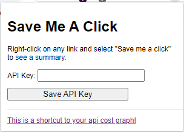

# Save Me A Click - Chrome Extension

Save Me A Click is a Chrome extension that provides a summary of a webpage when right-clicking on a link. It displays a popup with a title, body, and summary without needing to open the page.  

[Get it on the chrome web store](https://chrome.google.com/webstore/detail/save-me-a-click/cnhbeajhcgafdechfbffebemcnfkofbh/related)  

## Features  

- Right-click context menu item to fetch summary
- Displays an overlay with the fetched summary
- Overlay can be closed by clicking outside the popup

Current supported social media websites:  
- [X] Facebook  
- [X] Linkedin  
- [X] Youtube  
- [ ] Instagram  
- [ ] Twitter  

## Installation

1. Download the pre-built extension zip file from [our latest release](https://github.com/marksverdhei/save-me-a-click-chrome-extension/releases/latest)
2. Unzip the file in the directory you want your chrome extension
3. Open Google Chrome and navigate to `chrome://extensions/`.
4. Enable "Developer mode" by toggling the switch in the top right corner.
5. Click the "Load unpacked" button and select the directory containing the extension files.

The extension should now be installed and active in your Chrome browser.

## Setting API key  

In order for the extension to work, you need to set an OpenAI API key.  
To set the API key simply click the chrome extension icon and paste in the key in the field.  

#### How to get an Openai API key  

1. Create an account at https://openai.com/
2. Register your account as a paid account https://platform.openai.com/account/billing/overview (free trial does not work)
3. Create a new API key at https://platform.openai.com/account/api-keys (copy it and save it somewhere)
This currently only works for paid accounts (ass opposed to free-trial accounts)

For your own usage, save me a click should be very cheap in terms of api costs. 
You can try setting a hard limit of costs here: https://platform.openai.com/account/billing/limits

## Usage

1. Right-click on any link in a webpage.
2. Select "Save me a click" from the context menu.
3. A popup with the summary will appear near the clicked link.

## Project Structure

- `background.js`: Handles context menu creation and message passing between content and background scripts.
- `content.js`: Handles DOM manipulation to display the summary overlay and manages communication with the background script.
- `overlay.css`: Contains the styling for the summary overlay and spinner.

## Building project locally  

1. Make sure you have npm installed. If not, install npm  
2. run `npm i`  
3. run `npx webpack`  
